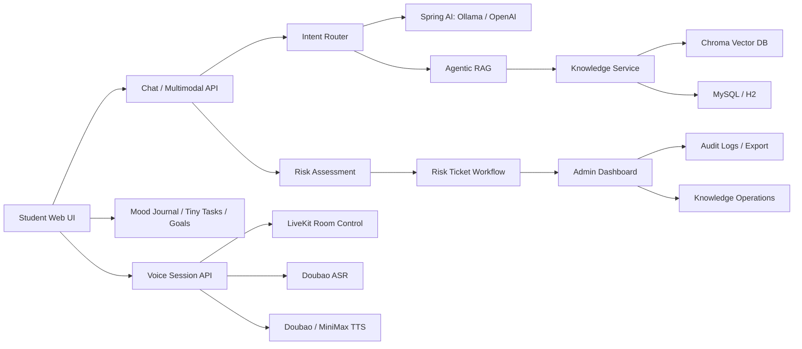

# Multimodal MindCare Agent

<div align="center">

### A production-style campus mental-health AI support system

Student support chat | Multimodal risk assessment | RAG knowledge operations | Crisis workflow | Real-time voice architecture

<p>
  
  
  
  
  
</p>

</div>

---

## Overview

Multimodal MindCare Agent is an AI-assisted campus mental-health support platform. It is designed around a real support workflow instead of a single chatbot page: students can chat, record mood journals, complete small support tasks, and review conversation history; administrators can manage risk tickets, student profiles, intervention notes, audit logs, knowledge base entries, and trend dashboards.

The system connects LLM chat, RAG, multimodal risk signals, voice interaction, and backend case management into one deployable product prototype.

> This project is a technical prototype for support workflow research and engineering demonstration. It is not a medical diagnosis system and should not replace professional mental-health services.

---

## Product Highlights

| Module | What it provides |
| --- | --- |
| Student support | SSE streaming chat, conversation history, mood journal, support goals, tiny tasks |
| Risk assessment | Text risk, audio/visual signal fusion, confidence display, risk explanation |
| Crisis workflow | Risk tickets, SLA reminders, contact records, escalation, referral, close reasons |
| Admin case management | Student profiles, recent chats, mood trends, task completion, notes, audit trail |
| RAG knowledge base | Knowledge categories, citations, retrieval test console, version control, feedback |
| Voice assistant | LiveKit control channel, Doubao ASR/TTS integration points, interruption, summaries |
| Deployment | Docker Compose with MySQL, Redis, Chroma, Ollama, Mailpit, and GPU-ready local model |

---

## Architecture



---

## Tech Stack

| Layer | Technologies |
| --- | --- |
| Backend | Java 17, Spring Boot 3.3, WebFlux, Spring Security, Spring Validation |
| AI | Spring AI, Ollama, Qwen2.5 GGUF, OpenAI-compatible fallback |
| RAG | Local retrieval, Chroma, knowledge chunking, citation feedback |
| Data | MySQL 8.4, H2 for local demo, Redis, JPA |
| Voice | LiveKit control channel, Doubao ASR, Doubao TTS, MiniMax TTS client |
| Ops | Docker Compose, Mailpit, Actuator, CSV export |
| Frontend | Static HTML/CSS/JavaScript, SSE streaming, enterprise-style dashboard layout |

---

## Key Screens

The frontend is organized around four product workspaces:

- **Student Support**: chat, attachments, mood journal, tiny tasks, support goals, history sessions
- **Risk Dashboard**: risk queue, filters, SLA state, ticket handling
- **Knowledge Operations**: source list, category/version controls, search test console, citation feedback
- **Case Profile**: student trend, recent conversations, tasks, tickets, notes, audit trail

Add screenshots under `docs/assets/` and link them here after uploading the project.

---

## Quick Start with Docker

1. Create `.env` from `.env.example`.

```powershell
copy .env.example .env
```

2. Fill the required passwords in `.env`.

```text
DB_PASSWORD=change-me-strong-password
MYSQL_ROOT_PASSWORD=change-me-root-password
SEED_DEMO_USERS=true
MULTIMODAL_AGENT_ADMIN_PASSWORD=admin-password-at-least-12
MULTIMODAL_AGENT_STUDENT_PASSWORD=student-password-at-least-12
```

3. Start the stack.

```powershell
docker compose up -d --build
```

4. Open the app.

```text
http://localhost:8080
```

5. Check health.

```powershell
curl http://localhost:8080/actuator/health
```

---

## Local Development

Run tests:

```powershell
mvn test
```

Run Spring Boot locally:

```powershell
mvn spring-boot:run
```

Use Ollama locally:

```powershell
$env:AI_PROVIDER="ollama"
$env:OLLAMA_BASE_URL="http://localhost:11434"
$env:OLLAMA_MODEL="multimodalAgent-qwen2.5-7b-ft:latest"
mvn spring-boot:run
```

Use OpenAI-compatible model:

```powershell
$env:AI_PROVIDER="openai"
$env:OPENAI_API_KEY="your-api-key"
$env:OPENAI_MODEL="gpt-4o-mini"
mvn spring-boot:run
```

---

## Voice Configuration

Voice features are optional. Configure them only when you have provider credentials.

```powershell
$env:VOICE_ENABLED="true"
$env:LIVEKIT_URL="wss://your-livekit-server"
$env:LIVEKIT_API_KEY="your-livekit-api-key"
$env:LIVEKIT_API_SECRET="your-livekit-api-secret"

$env:VOICE_ASR_PROVIDER="doubao"
$env:VOICE_ASR_ENDPOINT="wss://openspeech.bytedance.com/api/v3/sauc/bigmodel"
$env:VOICE_ASR_APP_ID="your-volcengine-app-key"
$env:VOICE_ASR_API_KEY="your-volcengine-access-key"
$env:VOICE_ASR_CLUSTER="volc.bigasr.sauc.duration"

$env:VOICE_TTS_PROVIDER="doubao"
$env:VOICE_TTS_ENDPOINT="wss://openspeech.bytedance.com/api/v3/tts/unidirectional/stream"
$env:VOICE_TTS_API_KEY="your-doubao-tts-api-key"
$env:VOICE_TTS_RESOURCE_ID="seed-tts-2.0"
$env:VOICE_TTS_VOICE="zh_female_vv_uranus_bigtts"
```

Then check:

```powershell
curl -u student:your-student-password http://localhost:8080/api/voice/status
```

---

## API Examples

Student profile:

```powershell
curl -u student:your-student-password http://localhost:8080/api/profile
```

Streaming chat:

```powershell
curl -N -u student:your-student-password `
  -H "Content-Type: application/json" `
  -d "{\"message\":\"I feel stressed recently. Can you help me calm down?\"}" `
  http://localhost:8080/api/chat/stream
```

Student conversation history:

```powershell
curl -u student:your-student-password http://localhost:8080/api/chat/sessions
```

Admin risk tickets:

```powershell
curl -u admin:your-admin-password http://localhost:8080/api/admin/risk-tickets
```

Knowledge operations:

```powershell
curl -u admin:your-admin-password http://localhost:8080/api/admin/knowledge
```

---

## Repository Structure

```text
src/main/java/com/multimodalAgent/agent
  config/        Spring, security, AI, MCP, schema configuration
  controller/    Chat, voice, support, report, risk ticket, knowledge APIs
  domain/        JPA entities and enums
  dto/           Request and response records
  repository/    Spring Data repositories
  security/      Current user and authentication support
  service/       AI, RAG, support workflow, voice, risk, admin operations

src/main/resources/static
  index.html     Main web app
  app.js         Frontend state and API interaction
  styles.css     Enterprise-style UI layout

docs/
  hardening-guide.md
  VOICE_AGENT_CONTROL_CHANNEL.md
  qwen25-7b-lora-finetune-guide.md
```

---

## Security Notes

- `.env` is ignored and must not be committed.
- Demo users are disabled by default unless `SEED_DEMO_USERS=true`.
- `/mcp` is disabled unless `MCP_SERVER_ENABLED=true`.
- MCP calls require `X-MCP-Token` when enabled.
- Do not upload API keys, LiveKit secrets, ASR/TTS credentials, local databases, or model weight files to GitHub.

---

## Uploading to GitHub

Before pushing the project:

```powershell
git status
```

Make sure these files are not included:

```text
.env
data/
target/
.m2/
*.gguf
*.gguf.zip
scripts/start-voice-dev.ps1
```

Recommended repository name:

```text
multimodal-mindcare-agent
```

---

## Roadmap

- Add screenshots and demo video to the README
- Add frontend E2E tests for student-to-admin risk workflow
- Add benchmark dashboard for response latency
- Add knowledge base import/export and document rollback UI
- Add real voice session acceptance tests with provider sandbox credentials
- Add deployment guide for cloud and campus intranet scenarios

---

## License

Add a license before publishing publicly. For an open-source portfolio project, MIT or Apache-2.0 are common choices.

---

<div align="center">

Built as a practical AI product prototype: explainable, workflow-driven, and ready for real engineering iteration.

</div>
