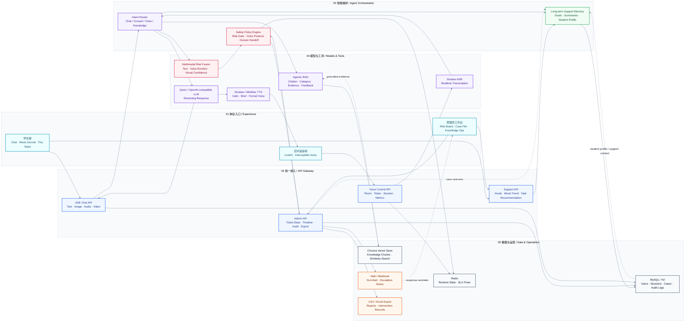

# Multimodal MindCare Agent

<div align="center">

### 多模态校园心理支持智能体 | Campus Mental-Health AI Support System

**Chat + RAG + Multimodal Risk + Voice AI + Admin Case Workflow**

<p>
  
  
  
  
  
</p>


<br>

一个面向校园心理支持场景的 AI 产品原型：从学生对话、情绪日记、小任务，到风险工单、危机干预、知识库运营和语音陪伴，构建完整的支持闭环。

An applied AI product prototype for campus mental-health support: student chat, mood journaling, tiny tasks, risk tickets, crisis workflow, knowledge operations, and voice companionship in one system.

</div>

---

## 项目定位 | Product Positioning

**Multimodal MindCare Agent** 不是一个简单聊天机器人，而是一个围绕“持续支持”和“后台处置”设计的 AI 支持系统。

It is not only a chatbot. It is designed as a workflow-oriented AI support platform that connects the full path from student conversation to administrator intervention.

> 说明：本项目用于技术研究、产品原型和工程展示，不提供医学诊断，也不能替代专业心理服务。  
> Note: This project is for engineering demonstration and research prototyping. It is not a medical diagnosis system.

---

## 核心亮点 | Highlights

<table>
  <tr>
    <td width="33%">
      <h3>持续支持闭环</h3>
      <p><b>From chat to continuous care</b></p>
      <p>学生端不止聊天，还包含历史会话、情绪日记、支持目标、小任务和趋势追踪，让一次性对话变成持续支持。</p>
    </td>
    <td width="33%">
      <h3>危机干预流程</h3>
      <p><b>Risk workflow, not just risk labels</b></p>
      <p>高风险识别后进入工单、SLA、联系记录、升级、转介、结案和审计链路，支持真实后台处置。</p>
    </td>
    <td width="33%">
      <h3>可信 RAG 与多模态</h3>
      <p><b>Grounded and explainable AI</b></p>
      <p>回答带知识引用、分类和反馈；风险判断展示文本、语音、视觉置信度，降低黑箱感。</p>
    </td>
  </tr>
  <tr>
    <td width="33%">
      <h3>实时语音架构</h3>
      <p><b>Voice-ready companion system</b></p>
      <p>预留 LiveKit 控制通道、Doubao ASR/TTS、打断和会话总结能力，让心理陪伴从文字扩展到语音。</p>
    </td>
    <td width="33%">
      <h3>企业级后台视角</h3>
      <p><b>Operational dashboard</b></p>
      <p>管理员可查看风险趋势、学生画像、知识库运营、审计日志和导出结果，适合正式场景演示。</p>
    </td>
    <td width="33%">
      <h3>可部署工程闭环</h3>
      <p><b>Deployable engineering stack</b></p>
      <p>Docker Compose 集成 MySQL、Redis、Chroma、Ollama、Mailpit，支持 GPU 本地推理和外部模型切换。</p>
    </td>
  </tr>
</table>

---

## 功能地图 | Feature Map

| 模块 Module | 中文说明 | English Description |
| --- | --- | --- |
| Student Chat | 学生端流式对话、会话历史、附件输入 | Streaming support chat, session history, multimodal input |
| Mood Journal | 情绪日记、触发因素、趋势分析 | Mood entries, triggers, trend analytics |
| Tiny Tasks | 智能小任务推荐与完成率追踪 | Smart tiny-task recommendation and completion tracking |
| Risk Detection | 文本、语音、图像信号融合评估 | Text, audio, visual signal fusion for risk assessment |
| Crisis Workflow | 工单、SLA、转介、结案、审计 | Tickets, SLA, referral, closure, audit trail |
| RAG Knowledge Base | 引用、分类、版本、检索测试台 | Citations, categories, versions, retrieval test console |
| Voice AI | LiveKit 控制通道、ASR、TTS、打断 | LiveKit control channel, ASR, TTS, interruption |
| Deployment | Docker Compose 与 GPU 推理 | Docker Compose with GPU-backed local inference |

---

## 系统架构 | Architecture



---

## 技术栈 | Tech Stack

<table>
  <tr>
    <td><b>Backend</b></td>
    <td>Java 17, Spring Boot 3.3, WebFlux, Spring Security, Validation</td>
  </tr>
  <tr>
    <td><b>AI Layer</b></td>
    <td>Spring AI, Ollama, Qwen2.5 GGUF, OpenAI-compatible models</td>
  </tr>
  <tr>
    <td><b>RAG</b></td>
    <td>Local retrieval, Chroma, knowledge chunking, citations, feedback</td>
  </tr>
  <tr>
    <td><b>Data</b></td>
    <td>MySQL 8.4, H2, Redis, JPA</td>
  </tr>
  <tr>
    <td><b>Voice</b></td>
    <td>LiveKit control channel, Doubao ASR, Doubao TTS, MiniMax TTS client</td>
  </tr>
  <tr>
    <td><b>Ops</b></td>
    <td>Docker Compose, Mailpit, Actuator, CSV export, GPU-ready Ollama</td>
  </tr>
  <tr>
    <td><b>Frontend</b></td>
    <td>Static HTML/CSS/JavaScript, SSE streaming, enterprise dashboard layout</td>
  </tr>
</table>

---

## 快速启动 | Quick Start

### 1. 准备环境 | Prepare `.env`

```powershell
copy .env.example .env
```

Fill required values:

```text
DB_PASSWORD=change-me-strong-password
MYSQL_ROOT_PASSWORD=change-me-root-password
SEED_DEMO_USERS=true
MULTIMODAL_AGENT_ADMIN_PASSWORD=admin-password-at-least-12
MULTIMODAL_AGENT_STUDENT_PASSWORD=student-password-at-least-12
```

### 2. Docker 启动 | Start with Docker

```powershell
docker compose up -d --build
```

Open:

```text
http://localhost:8080
```

Health check:

```powershell
curl http://localhost:8080/actuator/health
```

### 3. 本地测试 | Run Tests

```powershell
mvn test
```

---

## 模型与语音 | Model & Voice

### Ollama / Local LLM

```powershell
$env:AI_PROVIDER="ollama"
$env:OLLAMA_BASE_URL="http://localhost:11434"
$env:OLLAMA_MODEL="multimodalAgent-qwen2.5-7b-ft:latest"
mvn spring-boot:run
```

### Voice AI Providers

Voice features are optional. Configure them only when provider credentials are available.

```powershell
$env:VOICE_ENABLED="true"
$env:LIVEKIT_URL="wss://your-livekit-server"
$env:LIVEKIT_API_KEY="your-livekit-api-key"
$env:LIVEKIT_API_SECRET="your-livekit-api-secret"

$env:VOICE_ASR_PROVIDER="doubao"
$env:VOICE_ASR_ENDPOINT="wss://openspeech.bytedance.com/api/v3/sauc/bigmodel"
$env:VOICE_ASR_APP_ID="your-volcengine-app-key"
$env:VOICE_ASR_API_KEY="your-volcengine-access-key"
$env:VOICE_ASR_CLUSTER="volc.bigasr.sauc.duration"

$env:VOICE_TTS_PROVIDER="doubao"
$env:VOICE_TTS_ENDPOINT="wss://openspeech.bytedance.com/api/v3/tts/unidirectional/stream"
$env:VOICE_TTS_API_KEY="your-doubao-tts-api-key"
$env:VOICE_TTS_RESOURCE_ID="seed-tts-2.0"
$env:VOICE_TTS_VOICE="zh_female_vv_uranus_bigtts"
```

Check voice runtime:

```powershell
curl -u student:your-student-password http://localhost:8080/api/voice/status
```

---

## API Examples

```powershell
# Student profile
curl -u student:your-student-password http://localhost:8080/api/profile

# Streaming chat
curl -N -u student:your-student-password `
  -H "Content-Type: application/json" `
  -d "{\"message\":\"最近压力很大，可以陪我梳理一下吗？\"}" `
  http://localhost:8080/api/chat/stream

# Conversation history
curl -u student:your-student-password http://localhost:8080/api/chat/sessions

# Admin risk tickets
curl -u admin:your-admin-password http://localhost:8080/api/admin/risk-tickets

# Knowledge operations
curl -u admin:your-admin-password http://localhost:8080/api/admin/knowledge
```

---

## Repository Structure

```text
src/main/java/com/multimodalAgent/agent
  config/        Spring, security, AI, MCP, schema configuration
  controller/    Chat, voice, support, report, risk ticket, knowledge APIs
  domain/        JPA entities and enums
  dto/           Request and response records
  repository/    Spring Data repositories
  security/      Current user and authentication support
  service/       AI, RAG, support workflow, voice, risk, admin operations

src/main/resources/static
  index.html     Main web app
  app.js         Frontend state and API interaction
  styles.css     Enterprise-style UI layout
  assets/        Visual assets

docs/
  assets/
  hardening-guide.md
  VOICE_AGENT_CONTROL_CHANNEL.md
  qwen25-7b-lora-finetune-guide.md
```

---

## 安全说明 | Security Notes

- `.env` is ignored and must not be committed.
- Demo users are disabled by default unless `SEED_DEMO_USERS=true`.
- `/mcp` is disabled unless `MCP_SERVER_ENABLED=true`.
- MCP calls require `X-MCP-Token` when enabled.
- Do not upload API keys, LiveKit secrets, ASR/TTS credentials, local databases, or model weights.

---

## Roadmap

- Add real product screenshots and demo video
- Add frontend E2E tests for the full risk workflow
- Add latency dashboard for chat and voice responses
- Add richer knowledge base import/export and rollback
- Add real voice session acceptance tests with sandbox credentials
- Add production deployment guide for cloud or campus intranet environments

---

## License

Add a license before publishing publicly. MIT or Apache-2.0 are common choices for portfolio-style open-source projects.

---

<div align="center">

**Built as a practical AI product prototype: explainable, workflow-driven, and ready for real engineering iteration.**

中文场景驱动，English engineering presentation.

</div>
